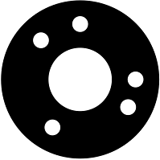

# visiona
visiona is an optical coded target tracking library. It allows to precisely and accurately determine the relative position and orientation of a target with respect to a calibrated camera. 

Some of the principles are described in details in the following (open-access) publication, along with test results ([download link](http://www.isprs-ann-photogramm-remote-sens-spatial-inf-sci.net/III-3/257/2016/isprs-annals-III-3-257-2016.pdf)):

    @article{cucci2016accurate,
      AUTHOR = {Cucci, D. A.},
      TITLE = {ACCURATE OPTICAL TARGET POSE DETERMINATION FOR APPLICATIONS IN AERIAL PHOTOGRAMMETRY},
      JOURNAL = {ISPRS Annals of Photogrammetry, Remote Sensing and Spatial Information Sciences},
      VOLUME = {III-3},
      YEAR = {2016},
      PAGES = {257--262},
    }

## Target

An example of the coded targets employed by visiona is reported below.

The position of the white dots in the black [annulus](https://en.wikipedia.org/wiki/Annulus_(mathematics)) encode a signal that is used for robust target detection.

visiona currently relies on configuration files to specify target properties (such as the dimension and the code) and the intrinsic camera calibration. 

A target example, ready to be printed and employed, can be generated with the [target/target.tex](target/target.tex) LaTeX file. A configuration file which would allow to detect such a target is given in [config/sample.cfg](config/sample.cfg).

**TODO:** add a target/config generation script.

## Usage

One should first include the main visiona headers:

	#include "Visiona.h"

To detect a target in an image, we first need to read the configuration file. Configuration file parsing is done via [libconfig](http://www.hyperrealm.com/libconfig ). Here is an example

	MarkerDetectorConfig cfg;
	cfg.loadConfig("config/sample.cfg")

Then a `MarkerDetector` object has to be created 

	MarkerDetector *detector = MarkerDetectorFactory::makeMarkerDetector(cfg);

Target detection is achieved by

    vector<shared_ptr<Target>> targets = detector->detect(raw);
    shared_ptr<Target> target = ret[0];

where `raw` is an opencv Mat object. The current implementation searches for a specific target whose code is known a-priori. The library is ready to detect and measure multiple different targets in the same image, but minor modifications to the code are required.

The returned `Target` objects accumulate the results of the detection and measurement steps.

*Optional:* black/white levels can be accurately identified with. This improve pretty much everything that comes later. If this method is not called before measurements, 0 (black) vs 255 (black) levels are assumed, which is never the case.

	detector->evaluateExposure(raw, target);

Two main methods are available for target measurement. The first is based on the solution of the [PnP problem](https://en.wikipedia.org/wiki/Perspective-n-Point) using the code points. It is fast and suited for real-real time applications:

	detector->measureRough(raw, target);

	translation = target.rought; // cv::Mat
	orientation = target.roughR; // cv::Mat

A more precise measurement of the target center and distance can be achieved with:

	detector->measure(raw, target);

	distance = target.distance;
	cv::Point2f center(target.cx, target.cy);

An application is included in the current source tree, called `batchdetector`, which allows to traverse a directory and process all the contained images. Refer to this application for degub options, visualization, timing statistics and other details.

## Dependencies

visiona depends on `opencv2`, `libconfig`, `eigen3`.

## Licence

The source code is released under a GPLv3 licence.
